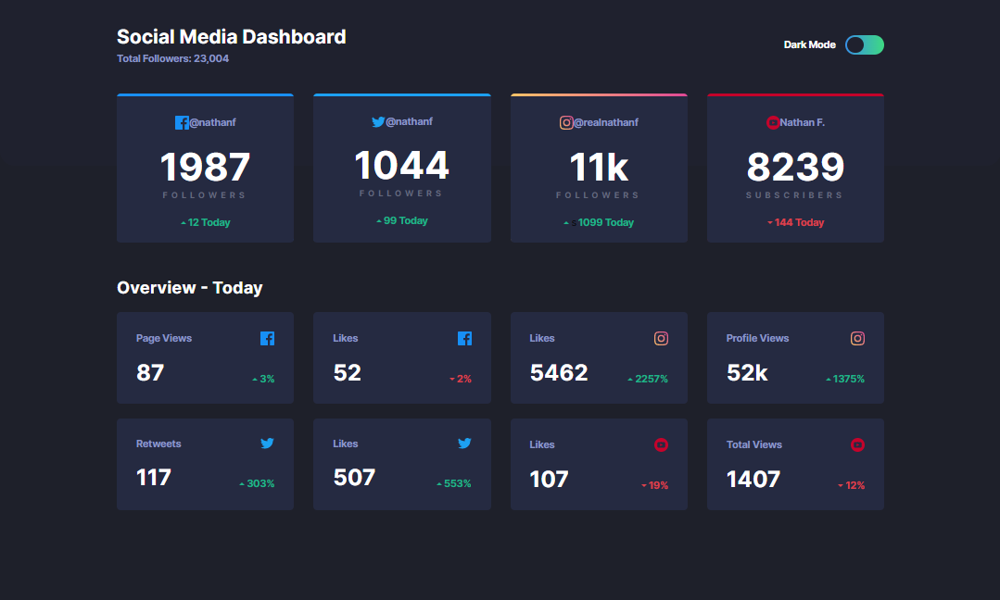

 

# Frontend Mentor - Social media dashboard with theme switcher solution

This is a solution to the [Social media dashboard with theme switcher challenge on Frontend Mentor](https://www.frontendmentor.io/challenges/social-media-dashboard-with-theme-switcher-6oY8ozp_H). Frontend Mentor challenges help you improve your coding skills by building realistic projects.

## Table of contents

- [Overview](#overview)
  - [The challenge](#the-challenge)
  - [Screenshot](#screenshot)
  - [Links](#links)
- [My process](#my-process)
  - [Built with](#built-with)
- [Author](#author)

## Overview

### The challenge

Users should be able to:

- View the optimal layout for the site depending on their device's screen size
- See hover states for all interactive elements on the page
- Toggle color theme to their preference

### Screenshot

### Links

- Solution URL: [github.com/marckesin/Social-Media-Dashboard](https://github.com/marckesin/Social-Media-Dashboard)
- Live Site URL: [social-media-dashboard-theme-switcher.netlify.app/](https://social-media-dashboard-theme-switcher.netlify.app/)

## My process

### Built with

- [Netlify](https://www.netlify.com/) - Build and deploy websites
- Semantic HTML5 markup
- CSS custom properties
- CSS Grid
- Flexbox
- Mobile-first workflow
- SASS/SCSS

## Author

- Frontend Mentor - [@marckesin](https://www.frontendmentor.io/profile/marckesin)
- Linkedin - [marckesin](https://www.linkedin.com/in/marckesin)
- Codewars - [marckesin](https://www.codewars.com/users/marckesin)
